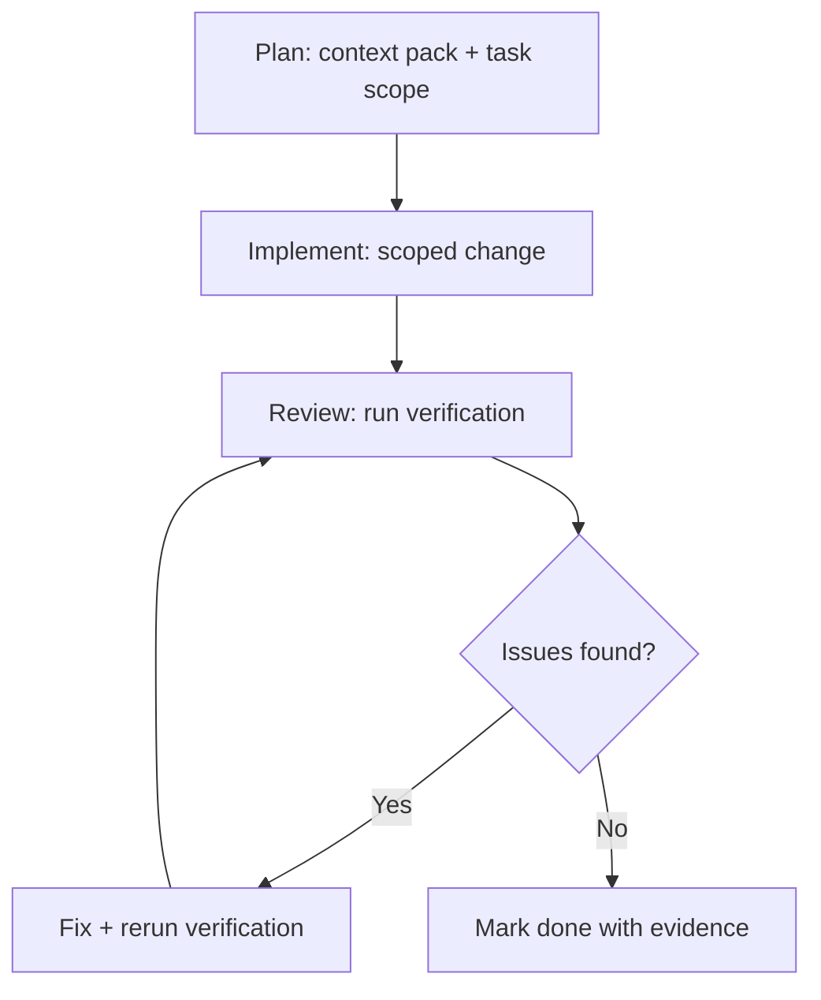

# Portfolio Agent Workflows

Spec-driven development workflow for the Corey Bui portfolio. Adapted from Homeify's beta agent workflows, scaled for a static marketing site.

## Operating Model

1. **Spec first** — work links to `docs/specs/portfolio/*` and `docs/tasks/portfolio/backlog.md`.
2. **Context pack before code** — read spec, task, dependencies, affected files, constraints, verification plan.
3. **One task at a time** — implement a single `PORT-*` ID unless explicitly batched.
4. **Verification as evidence** — tests, screenshots, or documented blockers.
5. **No fantasy completion** — do not mark done without acceptance criteria met.

## Lifecycle



**Preferred lifecycle:** Plan → Implement → Review → Fix issues found.

## Cursor Plan Mode → MD Plan → Build

For non-trivial `PORT-*` tasks:

1. **Plan (Cursor Plan mode)** — produce an MD Plan from the task template in `docs/tasks/portfolio/plans/README.md`. Do not edit product code.
2. **Review the plan** — confirm scope, excluded work, files, acceptance criteria, verification.
3. **Build** — implement only the approved plan.
4. **Review → Fix** — run verification; fix findings; rerun until criteria have evidence.

Skip Plan mode for one-line fixes, typos, or single obvious file changes.

## Agent Matrix (Lightweight)

| Area | Lead | QA Gate | Verification |
| --- | --- | --- | --- |
| Homepage UX | Frontend Developer | Accessibility Auditor | unit + E2E |
| Project cards / content | Frontend Developer | Code Reviewer | unit |
| SEO / metadata | SEO Specialist | Evidence Collector | build + manual |
| Performance | Performance Benchmarker | Test Results Analyzer | Lighthouse (manual) |
| Testing infrastructure | Frontend Developer | Test Results Analyzer | CI green |

Default: **one lead + one QA gate**. Add a pair only when crossing boundaries (e.g. SEO + accessibility).

## Activation Prompt Templates

**Task implementation:**

```text
Implement {TASK_ID} only. Read {SPEC_PATH} and docs/tasks/portfolio/backlog.md.
Respect Scope and Excluded. Return changed files, tests run, evidence, unresolved risks.
```

**Context pack:**

```text
Assemble a context pack for {TASK_ID}: spec, task, dependencies, affected files,
constraints from README and specs, verification plan, unknowns. Do not edit code yet.
```

## Constraints (All Tasks)

- Next.js 15 App Router, React 19, TypeScript, Tailwind CSS.
- Content lives in `data/` arrays; no CMS unless spec'd.
- Project URLs must be HTTPS-only when rendered as links.
- Respect `prefers-reduced-motion` for animations.
- No authentication or API routes unless a new spec introduces them.
- Commit messages reference task IDs: `feat: PORT-01-WEB-01 add mobile nav test`.

## Verification Commands

```bash
npm run typecheck
npm run lint
npm run test
npm run build
npm run test:e2e          # local
npm run test:e2e:ci       # CI (Chromium only)
```
