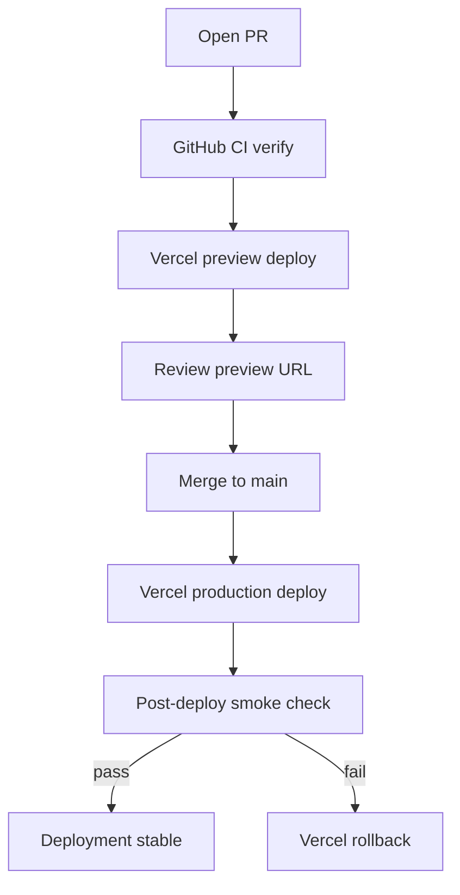

# Vercel Deployment Stabilization

## Objective

Restore reliable Vercel deployments for the portfolio and prevent future deploy failures caused by install drift, Node/tooling mismatch, duplicate source files, and missing operational guardrails.

## Problem

Production and preview deployments on Vercel are failing or at risk of intermittent failure because local CI, Vercel install settings, and dependency versions are not fully aligned.

| Risk | Current state | Impact |
| --- | --- | --- |
| Nondeterministic install | [`vercel.json`](../../../vercel.json) uses `npm install`; CI uses `npm ci` | Different dependency trees between CI and Vercel |
| Node version drift | No `engines` or `packageManager` in [`package.json`](../../../package.json); CI uses Node 22 | Vercel may build on a different Node major |
| Tooling major mismatch | `next@^15.x` with `eslint-config-next@^16.x` in lockfile | Lint/config drift; future CI or build failures |
| Duplicate sources | 11 untracked `* 2.*` files included by [`tsconfig.json`](../../../tsconfig.json) globs | Typecheck/lint/build scope pollution |
| Weak deploy ops | No documented rollback, log inspection, or post-deploy checks | Slow recovery when deploys fail |

## Affected Files

| File | Role |
| --- | --- |
| `vercel.json` | Vercel install/build commands |
| `package.json` | Node `engines`, `packageManager`, dependency versions |
| `package-lock.json` | Locked install graph |
| `tsconfig.json` | Optional exclude guardrail for `* 2.*` duplicates |
| `.github/workflows/ci.yml` | Pre-merge verification and CI hardening |
| `README.md` | Deployment settings and runbook |
| `app/* 2.ts`, `components/* 2.tsx`, `data/* 2.ts`, `hooks/* 2.ts`, `eslint.config 2.mjs` | Accidental duplicates to remove |

## Behavior Requirements

### Vercel project settings

- **Root directory:** `.` (repository root)
- **Framework:** Next.js (auto-detected)
- **Install command:** `npm ci`
- **Build command:** `npm run build`
- **Node.js version:** 22.x (match GitHub Actions)

### Package and runtime policy

- Pin `packageManager` to the npm version used locally (e.g. `npm@10.x`).
- Add `engines.node` requiring Node `>=22 <23` (or equivalent policy aligned with CI and Vercel).
- Keep `next` on the 15.x line until a separate Next 16 migration spec is approved.
- Align `eslint-config-next` major with `next` major (15.x while on Next 15).

### Repository hygiene

- Delete all accidental `* 2.*` duplicate source and config files after diffing against canonical files.
- Merge any unique content from duplicates into canonical files before deletion.
- Optionally exclude `**/* 2.ts` and `**/* 2.tsx` in `tsconfig.json` as a guardrail.

### CI gate (pre-merge)

GitHub Actions [`.github/workflows/ci.yml`](../../../.github/workflows/ci.yml) must continue to run before production deploys:

```bash
npm ci
npm run typecheck
npm run lint
npm run test
npm run build
npm run test:e2e:ci
```

Additional hardening:

- `permissions: read-all` (or minimal required permissions)
- `concurrency` group to cancel superseded runs on the same branch
- Upload Playwright traces/reports when E2E fails

### Deployment strategy

- **Primary:** Vercel Git integration — push to `main` triggers production; PRs get preview URLs.
- **Gate:** `main` branch protection requires the `CI / verify` check to pass before merge.
- **Not in scope:** Custom `vercel deploy --prebuilt` pipeline unless Git integration cannot meet requirements.

### Operational runbook

Document in `README.md`:

1. **Preview validation** — verify preview URL after PR deploy
2. **Production promotion** — merge to `main` after CI green
3. **Inspect failure** — `vercel inspect <deployment-url>`
4. **View errors** — `vercel logs <deployment-url> --level error`
5. **Rollback** — `vercel rollback` or promote last known-good deployment

## Acceptance Criteria

### Install and build parity

- [ ] `vercel.json` `installCommand` is `npm ci`
- [ ] `package.json` declares `engines.node` and `packageManager`
- [ ] Vercel project Node version set to 22.x
- [ ] `npm ci && npm run build` succeeds locally

### Tooling alignment

- [ ] `eslint-config-next` resolves to 15.x in `package-lock.json`
- [ ] `eslint-config-next` major matches `next` major in `package.json`
- [ ] `npm run lint` passes

### Repository hygiene

- [ ] No `* 2.*` source or config files remain under `app/`, `components/`, `data/`, `hooks/`, or repo root
- [ ] `npm run typecheck` passes

### CI hardening

- [ ] Workflow uses concurrency cancellation
- [ ] Workflow uses least-privilege permissions
- [ ] Playwright artifacts upload on E2E failure

### Documentation

- [ ] `README.md` documents Vercel settings, verification commands, and rollback steps

### Deploy verification

- [ ] Latest Vercel production deployment reaches `READY` status
- [ ] Homepage loads on production URL
- [ ] No build-time errors in Vercel deployment logs

## Edge Cases

- If Vercel build log shows a failure unrelated to install/tooling (e.g. missing env var, asset 404), fix that specific issue without expanding scope into new features.
- If aligning `eslint-config-next` surfaces new lint violations, fix only auto-fixable or directly related issues — no broad refactors.
- If a duplicate `* 2.*` file contains unique content not in the canonical file, merge into canonical before delete.
- Next.js 16 upgrade is out of scope; treat as a separate future spec.

## Dependency Map

**Depends on:**

- Existing remediation work where applicable:
  - [04-repository-hygiene.md](./remediation/04-repository-hygiene.md) — duplicate file removal (PORT-05-CHORE-01)
  - [09-eslint-next-version-alignment.md](./remediation/09-eslint-next-version-alignment.md) — ESLint alignment (PORT-05-CI-01)

**Blocks:**

- Reliable preview and production deploys for all subsequent portfolio work

**Related tasks:**

| Task ID | Scope |
| --- | --- |
| PORT-05-CHORE-01 | Remove duplicate `* 2.*` files |
| PORT-05-CI-01 | Align `eslint-config-next` with Next 15 |
| PORT-06-DEPLOY-01 | Vercel config, CI hardening, runbook (this spec) |

## Verification

### Local (must pass before deploy retry)

```bash
npm ci
npm run typecheck
npm run lint
npm run test
npm run build
npm run test:e2e:ci
```

### Vercel (after config changes merged)

```bash
# Optional — requires Vercel CLI auth
vercel build --prod
vercel inspect <deployment-url>
vercel logs <deployment-url> --level error
```

### Post-deploy smoke check

- Production URL returns HTTP 200
- Main sections render (hero, projects, contact)
- No console errors on initial page load

## Non-Goals

- Migrating to Next.js 16
- Replacing Vercel Git integration with a custom prebuilt deploy pipeline
- Adding runtime secrets, auth, or API routes
- Production error monitoring integrations (Sentry, log drains) — future work
- Lighthouse performance budgets in CI — future `PORT-03-PERF-01`

## Deployment Flow


